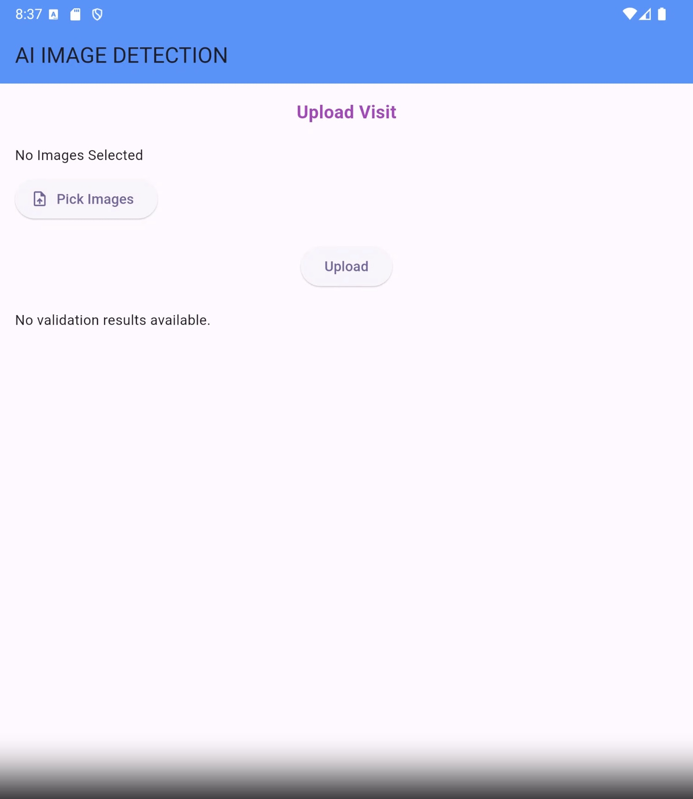
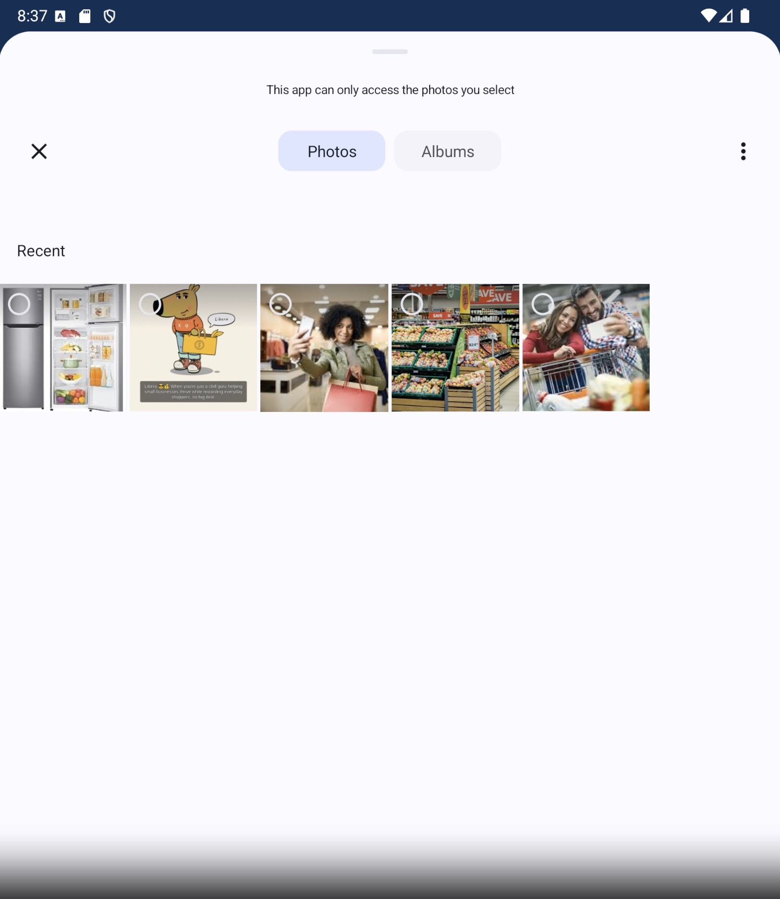
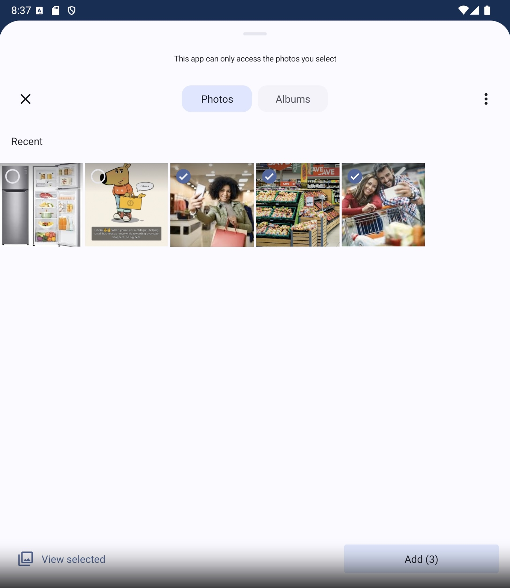
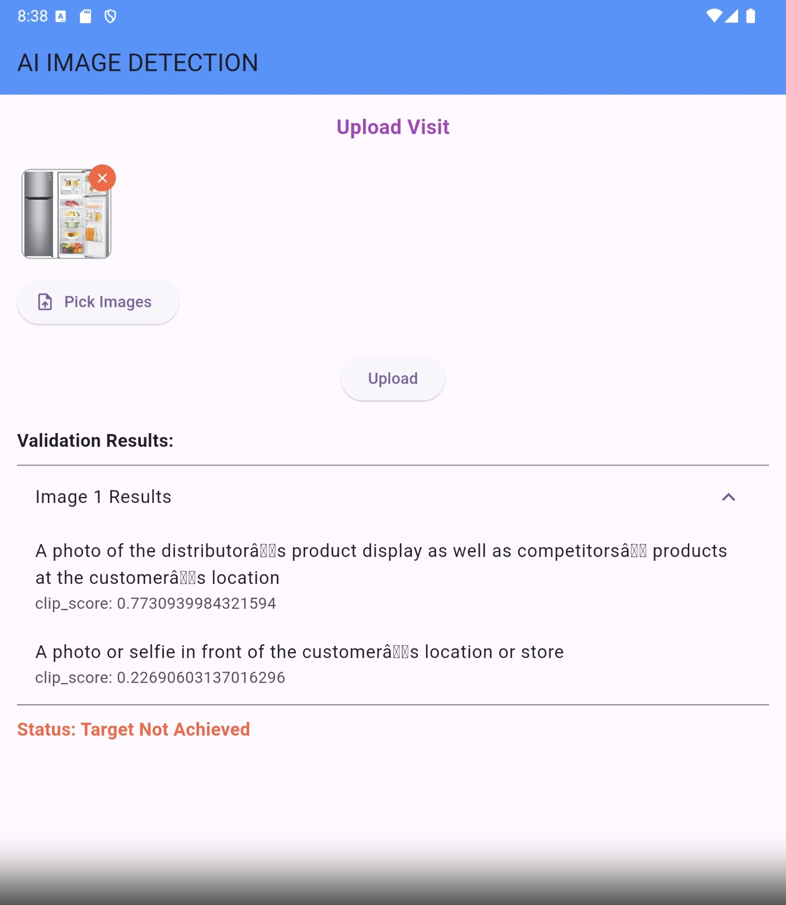

# Final Project - AI GPT Bootcamp Q4 2024 - Encode Club

## Image Object Detection for Distributor Salesmen’s Customer Visits

## Project Description
This project aims to develop a computer vision-based solution to streamline 
the image verification process for FMCG distributor admins. 
Salesmen visiting customers are required to capture and submit 5-10 
photos per customer as proof of visit, often including selfies, 
product displays, competitor surveys, and promotional materials. 
With each salesman visiting 25-40 customers daily, admins face the tedious task of manually reviewing up to 400 images per salesman every day. 
By implementing an image object detection system, this solution will automatically validate submitted images against admin-defined criteria, 
such as ensuring the presence of a face in selfies or verifying product displays. 
This automation reduces administrative workload, enhances efficiency, and ensures compliance with visit requirements.


## Prerequisites
Before you begin, ensure you have met the following requirements:

1. **Flutter Setup**
   - On your device, install Flutter SDK and set up the environment.
2. **Python Setup**
    - Python 3.8 or later
    - pip (Python package installer)


### Running the Project
Follow these steps:

1. **Clone the Repository**
   ```bash
   git https://github.com/ifanzalukhu97/Final-Project-AI-GPT-Bootcamp-Q4-2024-Encode-Club
   cd Final-Project-AI-GPT-Bootcamp-Q4-2024-Encode-Club
    ```

2. **Set Up Backend Server**
    ```bash
   cd backend
   
   # Create virtual environment
   python -m venv .venv
   
    # Activate virtual environment
    # For macOS/Linux:
    source .venv/bin/activate
   
    # For Windows:
    .\venv\Scripts\activate
    
    # Install dependencies
    pip install -r requirements.txt
    
    # Start the server
    python -m clip_server config.yml
   ```

3. Verify Server Status Visit http://0.0.0.0:51000/status in your browser.

## Report / Documentation
Salesmen visiting customers are required to capture and submit photos per customer as proof of visit, often including selfies, product displays, competitor surveys, and promotional materials.





System will automatically validate submitted images against admin-defined criteria, such as ensuring the presence of a face in selfies or verifying product displays.
When the image fulfills the criteria, the system will return the result as shown below (Target Achieved).


When criteria are not met, the system will return the result as shown below (Target Not Achieved).



## Demo Video

<video controls>
  <source src="https://drive.google.com/file/d/1gup7reR72-Bz-z4w2l4dWWElWgOCnlVv/view" type="video/webm">
  Your browser does not support the video tag.
</video>

or visit this link: [Demo Video](https://drive.google.com/file/d/1gup7reR72-Bz-z4w2l4dWWElWgOCnlVv/view)


## Contributors
- [Ifanzalukhu97](https://github.com/ifanzalukhu97) (ID: oBklq0)
- [Psianturi](https://github.com/Psianturi) (ID: o2gMEh)
